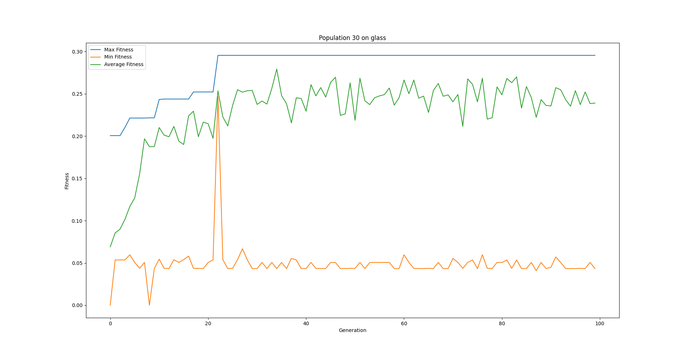
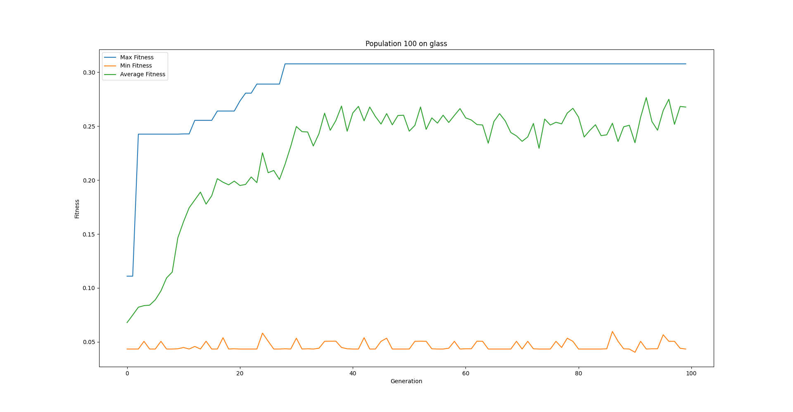
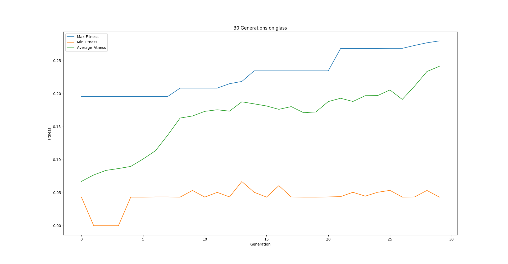
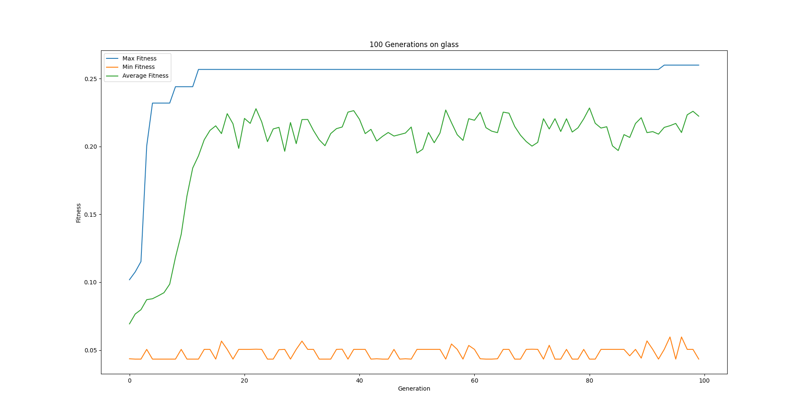
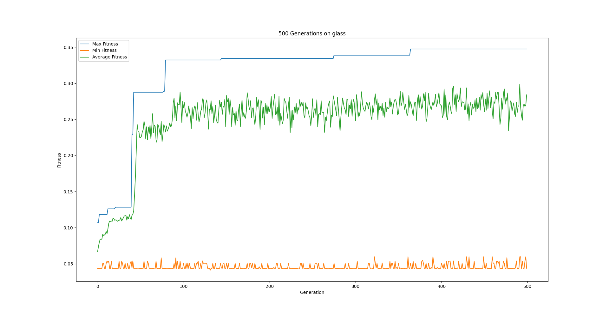
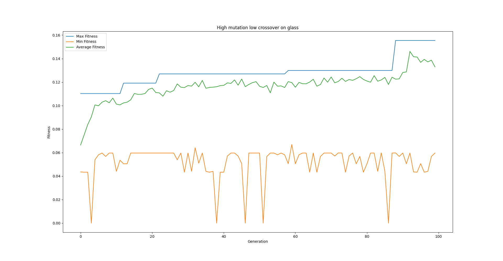
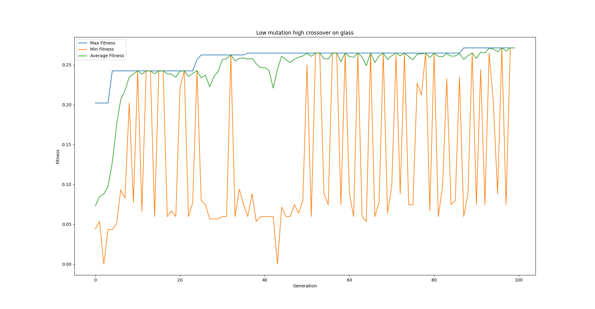

# TP1 Computação Natural

> Pedro Tavares de Carvalho - DCC - ICEx - UFMG

## Introdução

O objetivo desse trabalho é criar uma função de distância entre pontos, com o objetivo de diminuir número de dimensões da representação desses mesmos pontos. Essa função será obtida através da regressão simbólica de uma função entre dois pontos no espaço, comparando o *clustering* gerado pela função regredida com o gerado pela distância euclidiana entre os pontos.

O algoritmo específico utilizado para a fazer a regressão foi a Programação Genética Estruturada, baseada no paper [Unveiling the properties of structured grammatical evolution](https://www.researchgate.net/profile/Nuno_Lourenco2/publication/293043815_Unveiling_the_properties_of_structured_grammatical_evolution/links/5ef31c4192851cba7a462b0f/Unveiling-the-properties-of-structured-grammatical-evolution.pdf). Sua implementação foi em parte inspirada pela própria [implementação dos autores no github](https://github.com/nunolourenco/sge3), com modificações para diminuir o tempo por iteração e também diminuir o *overhead* de criação de gramáticas.

## Implementação

A implementação do algoritmo foi separada em duas partes. Uma parte foi a estrutura do algoritmo evolucionário genérico, com a aplicação dos operadores, seleção dos indivíduos e avaliação dos mesmos e a outra foi a implementação do indivíduo em si, sua representação genotípica e fenotípica e os operadores de mutação, *crossover* e reprodução.

### Representação do indivíduo

O indivíduo é gerado a partir de uma gramática livre de contexto e de uma relação das expansões da mesma com o gene de um indivíduo. O gene desse indivíduo representa a expansão de cada possível opção da gramática ordenadamente, ou seja, para cada não-terminal da gramática, existe uma lista que corresponde a cada expansão possível desse não terminal em cada uma de suas referências, e a expansão do indivíduo se dá através dessa lista, expandindo recursivamente cada um dos terminais.

Para a criação desse gene, primeiro se computa o número máximo de referências de cada possível não terminal da gramática, depois se gera uma lista aleatória do tamanho desse número máximo contendo qual expansão será feita na enésima referência a esse não-terminal. 

A expansão desse indivíduo se dá expandindo a gramática na ordem determinada por esses genes.

#### A gramática utilizada

A gramática utilizada foi a seguinte:

```python
{
	**{f"<expr_{i}>": [f"<expr_{i+1}> <op> <expr_{i+1}>", f"<func> ( <expr_{i+1}> <op> <expr_{i+1}> )"] for i in range(min_levels)},
    **{f"<expr_{min_levels + i}>": [f"<expr_{min_levels + i+1}> <op> <expr_{min_levels + i+1}>", f"<func> ( <expr_{min_levels + i + 1}> <op> <expr_{min_levels + i + 1}> )", "<term>"] for i in range(max_levels - min_levels)},
    f"<expr_{max_levels}>": ["<term_1> <op> <term_2>", "<term_2> <op> <term_1>"],
    "<term>": [
        "<term_1>", "<term_2>"
    ],
    "<term_1>": [
        "<var_1>",
        "<pre-op> ( <var_1> )",
    ],
    "<term_2>": [
        "<var_2>",
        "<pre-op> ( <var_2> )",
    ],
    "<pre-op>": [
        "1/",
        "-",
        "+",
        "abs",
        "numpy.math.sqrt"
    ],
    "<func>": [
        "abs",
        ""
    ],
    "<op>": [
        "+",
        "*",
        "-",
        "/",
    ],
    "<var_1>": vars1,
    "<var_2>": vars2,
}
```

Os terminais existentes são os operadores de soma, multiplicação, divisão e subtração, os precursores de inverso, negativo, valor absoluto e raiz quadrada, cada índice dos pontos possíveis dado o banco de dados, considerando o ponto $X_1$ e $X_2$, que são entradas para a função `lambda` que é o fenótipo do algoritmo.

#### Computação do número de referências máximo de cada não terminal

A computação se dá em dois passos. O no primeiro passo computamos o número máximo de referências diretas que cada não terminal possui, em relação a cada outro não terminal. Essa contagem se dá pelo pseudocódigo a seguir (o pseudocódigo também computa por quais terminais cada terminal é referido, para facilitar o segundo passo do algoritmo)

```python
 def countDirectReferences:
 		countReferences = {}
        isReferencedBy = {}
        for nt in self.non_terminals: # for each non-terminal in the grammar
            for production in self.grammar[nt]: # for each possible production on that non terminal
                count = {}
                for option in production: # iterate over the production's terms
                    if option in self.non_terminals: # if the term is a non terminal
                        count[option] += 1  # the number of times that option has been referenced increases
                        isReferencedBy[option].add(nt)
                
                for key in count:

                    countReferences[key][nt] = max(
                        countReferences[key][nt], count[key])   # the number of references of the non terminal is for this
                                                                # term is the maximum between all productions in this non terminal

```

No segundo passo do algoritmo, iteramos sobre cada não terminal `nt`e computamos o número máximo de referências que `nt` pode ter, entrando nos não terminais que possuem referência a `nt` e computando o seu número máximo de referências, e depois multiplicando esse número pelo número de referências máximo entre os não terminais que possuem referência a `nt`.

O pseudocódigo está a seguir:

```python
 def get_max_references(countReferencesByProd, nt):
    	results = []

        if nt == "<expr_0>": # if its the root term, the maximum number of references is one
            return 1

        references = sum(countReferencesByProd[nt].values()) # otherwise, initialize the reference count 
                                                             # as the sum of the direct references for the term
        for ref in isReferencedBy[nt]: 
            results.append(self.findReferences(
                ref, isReferencedBy, countReferencesByProd))

        references = references * max(results) # then multiply the referece count by the maximum number of references
                                               # in its referents

        
        return references
```

O pseudocódigo foi baseado no pseudocódigo oferencido no *paper* na introdução, porém com algumas modificações que o estavam tornando ineficiente. O limite superior do algoritmo mencionado no *paper* é maior do que o limite superior real, pois se soma todas as referências de um não terminal, e não o máximo de referências em uma das produções do terminal. Essa diferença estava aumentando o tamanho da representação do indivíduo enormemente, impactando tanto nos operadores de mutação quanto na memória total utilizada pelo algoritmo.

#### Diversidade Populacional

A diversidade populacional foi alcançada pela própria definição da gramática. A gramática possui um nível mínimo de expansões, que é passado por parâmetro, e que gera indivíduos que possuem um tamanho mínimo de árvore, mas que podem ser expandidos para aumentar o seu tamanho. 

#### Bloating

Como o algoritmo é baseado em uma gramática, o bloating do algoritmo é limitado pela geração da mesma, impedindo assim o crescimento indeterminado de um indivíduo, já que sua representação é de tamanho constante.

#### Expansão

A expansão do indivíduo se dá começando do símbolo inicial da gramática  e, para cada novo síbolo lido, substitua esse pela expansão correspondente no genótipo do indivíduo. Essa expansão se dá numa lista de strings, que, após o processamento completo de todos os símbolos, é convertida numa função `lambda` de python, que aumenta a eficiência do algoritmo enormemente.

###  Operadores genéticos

Os operadores genéticos foram criados a partir da descrição do SGE do paper, ou seja, a mutação é uma mutação ponto a ponto, em que o número de genes mutados é proporcional à probabilidade de mutação passada para o gerador de indivíduos, e o *crossover* é feito a partir de uma máscara que seleciona quais não terminais serão trocados entre um indivíduo e outro.

### Algoritmo evolucionário

A implementação do algoritmo evolucionário foi feita em uma classe, em que a população é gerada, avaliada e em que então os operadores são aplicados para a criação da próxima geração. A classe também possui parâmetros para facilitar a avaliação e teste de diferentes parâmetros do modelo e *backdoors* para a recuperação dos dados da evolução gerada, incluindo *fitness* média, máxima e mínima, *fitness* de teste, número de indivíduos mutados, reproduzidos e com *crossover* de cada geração e o número de indivíduos melhores do que os pais depois de um dos operadores aplicados.


A classe também imprime na tela o progresso corrente do algoritmo, e os dados atuais de *fitness* e outros metadados.

### Fitness

A *fitness* de um indivíduo foi computada pela comparação, utilizando a função `v_measure` do `sklearn` do cluster gerado pelo fenótipo do indivíduo (sua função de distância) com o cluster original utilizando distâncias euclidianas. O clustering do indivíduo é gerado a partir de uma matriz pré-computada de distâncias entre os pontos das tabelas de vetores de entrada. 

## Análise experimental

Apesar de relativamente eficiente, o algoritmo se provou lento em termos de avaliação. Cada iteração, com 100 indivídulos na população, demora por volta de 7 segundos, porém, considerando 100 gerações e 10 testes por geração para conseguirmos uma média, cada teste dura por volta de 3 horas, isso desconsiderando teste com popualção maior ou um número maior de gerações, por conta disso, a análise apresentada a seguir será feita considerando somente uma iteração do algoritmo com os parâmetros citados.

### Tamanho da população

Para avaliar o impacto do tamanho da população, fiz testes com população de 30, 100 e 500 indivíduos, com 100 gerações, tamanho de torneio 3, probabilidade de mutação 0.3, probabilidade de crossover de 0.6, profundidade mínima da árvore 2 e profundidade máxima da árvore 5. Os resultados estão nos gráficos a seguir:






Apesar de a análise não possuir muita validez estatística dado o número pequeno de repetições, podemos dizer que o impacto do tamanho da popualção foi perceptível quando passamos de 30 indivíduos para 100 indivíduos, provavelmente um indício de um espaço pequeno de busca com uma população tão pequena.

Essa diferença não se demonstra tão gritante entre a população de 100 indivíduos e de 500 indivíduos, ambos possuindo fitnesses médias e máximas parecidas ao fim da execução do algoritmo.

Dados esses resultados, os testes seguintes realizei com uma popualção de 100 indivíduos (novamente, entendo que não existe prova concreta da qualidade do parâmetro, porém não possuo poder computacional suficiente para fazer uma validação cruzada completa com todos os parâmetros) ((essa validação cruzada será feita em um futuro próximo, porém devido à proximidade da data de entrega, não consigo realisa-la para o relatório do trabalho.))

### Número de gerações

A análise do número de gerações foi feita com os mesmos parâmetros da análise de tamanho da população, fixando o tamanho da população em 100 indivíduos.







O número de gerações, diferente do tamanho da população, demonstrou um impacto grande tando na alteração de 30 para 100 quanto na alteração de 100 para 500. Em 30 gerações, o algoritmo não chega nem perto de convergir, já em 100, a fitness do melhor indivíduo se estabiliza um pouco ao final do algoritmo. Em 500 gerações, porém, essa fitness continua tendo pequenos *breakthroughs* e aumenta de 100 em 100 gerações, aproximadamente, 

### Crossover e mutação

A análise de crossover e mutação foi feita utilizando o tamanho de torneio 3, população e número de gerações 100 e os valores de probabilidade de mutação e de crossover especificados na descrição do TP.





O impacto da mudanças desses parâmetros é claramente observado pelos gráficos. Enquanto o gráfico com mutação alta e crossover baixo possui uma média mais baixa em geral, com (provavelmente) maior diversidade genética e fenotípica, o gráfico com baixa probabilidade de mutação possui uma média muito próxima ao melhor indivíduo.

Em termos de *exploration* vs *exploitation*, podemos dizer que o primeiro gráfico demonstra um processo de *exploration*. Seu espaço de soluções é buscado constantemente, gerando indivíduos com genes diferentes e portanto soluções diferentes. No caso do segundo gráfico, vemos o processo de *exploitation*. A partir do momento em que um indivíduo competente é encontrado, toda a população em análise se aproxima desse indivíduo, procurando soluções similares à oferecida pelo mesmo.

Como não foram feitas repetições na análise, a *exploitation* se verificou superior, dado que um indivíduo competente foi encontrado no primeiro momento, o que levou a um resultado superior do que a *exploration*.

## Conclusão

Pessoalmente, esse trabalho foi uma ótima experiência *hands on* com computação evolutiva e suas particularidades. Entre descobrir uma representação compacta e eficiente e melhorar a performance dos algoritmos, diversos detalhes que ficavam abstratos na minha mente se tornaram reais e concretos, e creio que serei mais eficaz e eficiente nas próximas implementações.

O algoritmo apresentou resultados razoáveis, especificamente no banco de dados de tipos de vidros, que poderiam ser melhorados com uma análisa mais profunda de hiperparâmetros e dos terminais utilizados.

Apesar disso, a implementação de uma SGE foi eficiente e os resultados se demonstraram promissores, com fitnesses crescentes e operadores de *crossover* e mutação eficientes.

## Referências


```
@article{Lourenco2016,
 title={Unveiling the properties of structured grammatical evolution},
  author={Louren{\c{c}}o, Nuno and Pereira, Francisco B and Costa, Ernesto},
  journal={Genetic Programming and Evolvable Machines},
  volume={17},
  number={3},
  pages={251--289},
  year={2016},
  publisher={Springer}
}
```

- Github com uma implementação de SGE genérica - https://github.com/nunolourenco/sge3

- Aulas da disciplina
- Documentação do `sklearn`, `numpy` e `python` em geral
- Stack Overflow